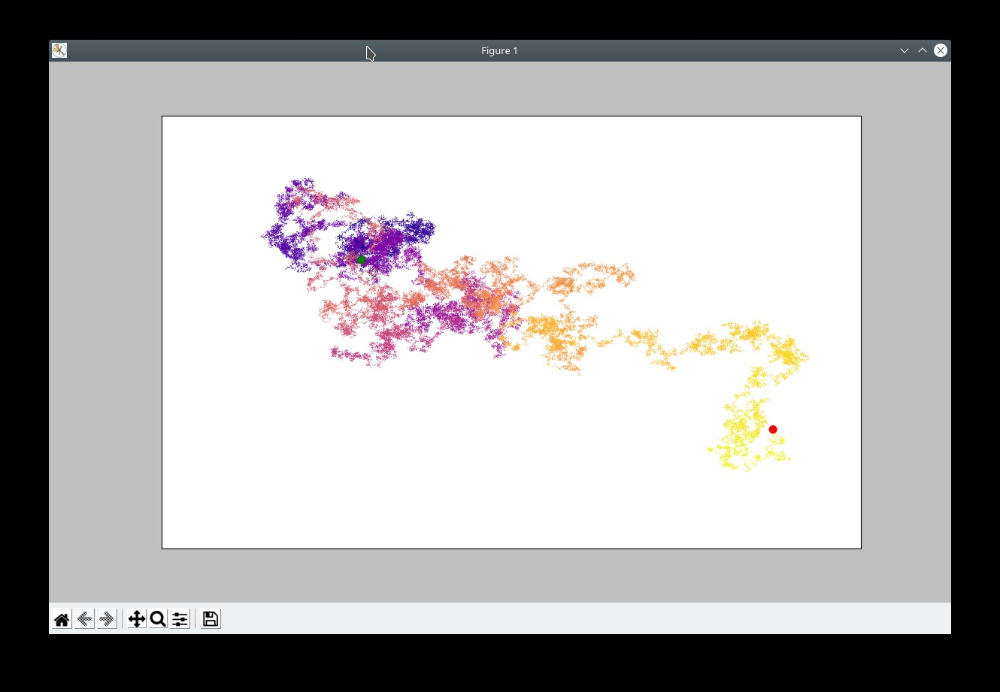
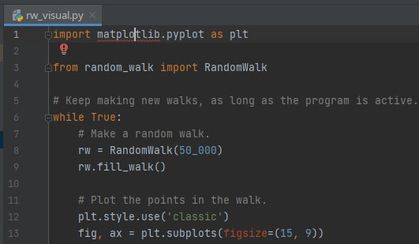
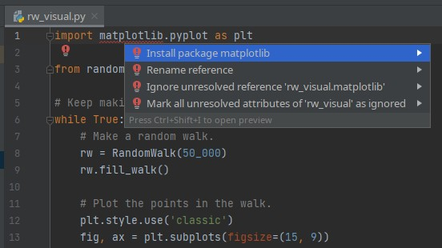

# random-walks

Random Walks project from Python Crash Course



## Add Matplotlib package when using PyCharm

The Random Walks app requires the Matplotlib package to be installed.
If it is missing, PyCharm will show the following error:



To add the package for the Random Walks app, move the cursor to *import matplotlib.pyplot as plt* and press *Alt-enter*. The following popup menu should be shown:



To install the Matplotlib package, select *Install package matplotlib*. This only works when using a correctly configured virtual environment.

## Installing Matplotlib

To install Matplotlib for the current user, enter the following command at a terminal prompt:

```
$ python -m pip install --user matplotlib
```

To install Matplotlib globally on Debian based systems, do:

```
# apt-get install python3-matplotlib
```
